<div align="center">
  
</div>

<div align="center">
   


[](https://python.org)
[](https://nodejs.org)
[](https://langchain.com)
[](https://chromadb.com)
[](https://ollama.ai)
[](https://react.dev)
[](LICENSE)
[](https://github.com/officiallyutso/chronicle)

**Revolutionizing Digital Workflow Intelligence with AI-Powered Activity Analysis**

*Chronicle is a comprehensive, privacy-first activity tracking and analysis platform that leverages cutting-edge AI technologies to monitor, analyze, and narrativize your digital workflow. Built with modern technologies including LangChain, Ollama, ChromaDB, and React, Chronicle provides intelligent insights into your development activities while keeping all data completely local and secure.*
</div>

---

# Table of Contents

<details>
<summary>System Architecture</summary>

- [Overview](#overview)
- [Technology Stack](#technology-stack)

</details>

<details>
<summary>Core Components</summary>

- [VS Code Extension](#vs-code-extension)
- [Browser Extension](#browser-extension)
- [System Monitor](#system-monitor)
- [Desktop Application](#desktop-application)

</details>

<details>
<summary>AI & Vector Database</summary>

- [Agentic AI System](#agentic-ai-system)
- [Vector Database Integration](#vector-database-integration)

</details>

<details>
<summary>Installation & Setup</summary>

- [Prerequisites](#prerequisites)
- [Step-by-Step Installation](#step-by-step-installation)
- [Advanced Configuration](#advanced-configuration)

</details>

<details>
<summary>API Reference</summary>

- [Core Backend Endpoints](#core-backend-endpoints)
- [WebSocket Events](#websocket-events)
- [Extension APIs](#extension-apis)

</details>

<details>
<summary>Performance & Security</summary>

- [Performance Optimization](#performance-optimization)
- [Security & Privacy](#security--privacy)

</details>

<details>
<summary>Development</summary>

- [Development Setup](#development-setup)
- [Project Structure](#project-structure)
- [Troubleshooting](#troubleshooting)

</details>

<details>
<summary>Future Roadmap</summary>

- [Future Roadmap](#future-roadmap)

</details>

<details>
<summary>License & Acknowledgments</summary>

- [License](#license)
- [Acknowledgments](#acknowledgments)

</details>

---

## System Architecture Overview

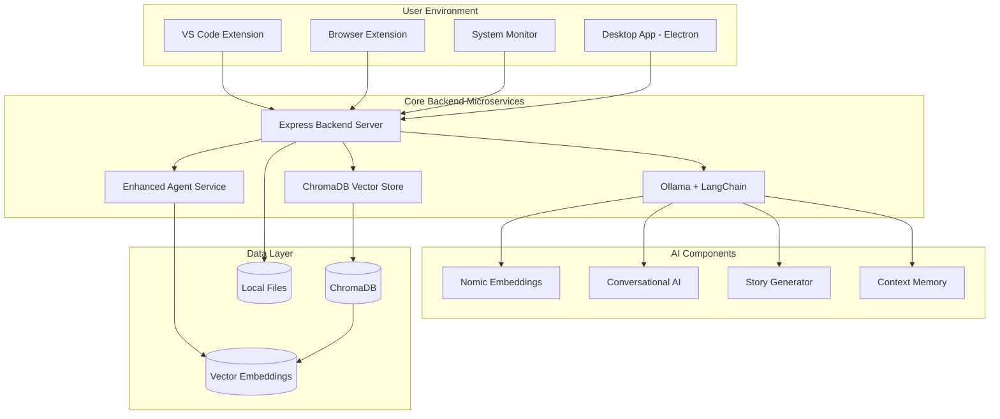

---

## Technology Stack

### Core Technologies
| Component | Technology | Version | Purpose |
|-----------|------------|---------|---------|
| **Frontend** | React 19 + TypeScript | 19.1.0 | Modern UI with type safety |
| **Desktop App** | Electron | 37.1.0 | Cross-platform desktop application |
| **Backend** | Express.js + TypeScript | 4.18.2 | RESTful API and WebSocket server |
| **AI Framework** | LangChain | 0.3.57 | Agentic AI and language model integration |
| **Vector Database** | ChromaDB | 3.0.6 | Semantic search and embeddings storage |
| **Embeddings** | Nomic-embed-text | Latest | High-quality text embeddings |
| **LLM** | Ollama + Llama3 | Latest | Local language model inference |
| **Build Tool** | Vite | 7.0.0 | Fast development and build system |

---

## Activity Tracker Features

| Description | Screenshot |
|-------------|------------|
| **Dashboard** - Main interface showing overview of your daily activities and statistics |  |
| **Activity Panel** - View and manage your tracked activities with detailed information |  |
| **Activity Details** - Detailed view of individual activities with time tracking and metadata |  |
| **Activity Sorting** - Sort and filter activities by different criteria for better organization |  |
| **Activity Based Narrative - Tone Selection** - Choose the tone and style for generating narratives from your activities |  |
| **Activity Based Narrative - Story Generation** - Generate compelling stories and narratives based on your tracked activities |  |
| **Activity Based Narrative - Achievement Summary** - View achievements and milestones based on your activity patterns |  |
| **Agentic AI Context Chat** - Chat with AI about your daily activities and get insights from your data |  |
| **AI Chat Interface** - Interactive chat interface for discussing your activities with AI assistance |  |
| **AI Data Context** - AI shows the specific data it's referencing when providing insights about your activities |  |
| **Project AI - VS Code Integration** - Automatically detects and connects to your VS Code projects for enhanced tracking |  |
| **Project AI - Project Summary** - Get comprehensive summaries of your projects including structure and progress |  |
| **Project AI - File Structure** - View detailed file structure and organization of your projects |  |
| **Project AI - README Generation** - Generate perfect README files automatically based on your project structure and activity |  |
| **Settings & Clear Data** - Manage application settings and clear your data when needed |  |
| **Browser Extension** - Track your web browsing activities and integrate with the main application |  |
| **Browser Extension Integration** - Seamless integration between browser extension and main application |  |
| **VS Code Extension - Available Commands** - View all available commands and features within the VS Code extension |  |
| **VS Code Extension - Activity Log** - Track your coding activities directly within VS Code with detailed logging |  |
| **VS Code Extension - Project Summary** - Get project summaries and insights directly within your VS Code workspace |  |
| **UNITY - AI package** - Package to generate npc characters - Agentic AI  |  |
| **UNITY - NPC AI** - Package to generate scriptable npc characters - Agentic AI  |  |

---


## VS Code Extension Architecture

### Extension Components

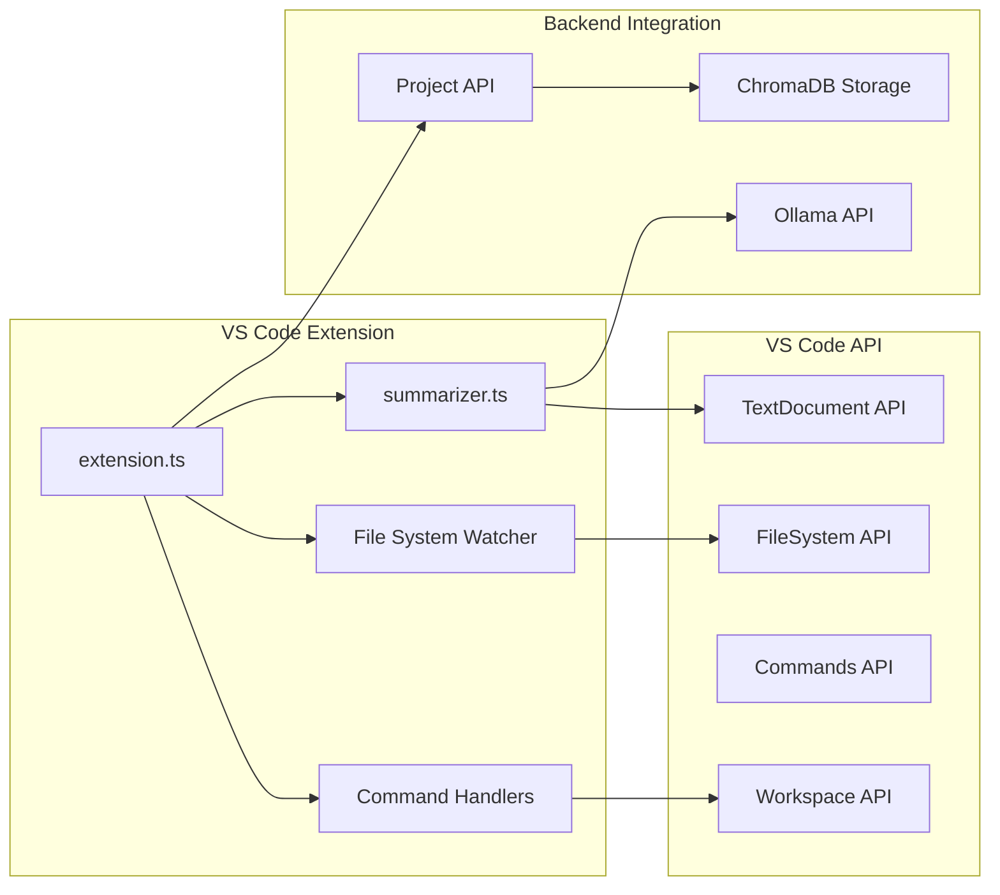


### Core Features

**File Activity Tracking**
- Monitors file open/close/save operations
- Tracks file modifications and creations
- Captures project-level context and metadata
- Filters development-relevant file types

**Intelligent Project Analysis**
- Generates comprehensive project summaries using Ollama
- Analyzes folder structures and file relationships
- Creates contextual file summaries with AI
- Exports structured project data to backend

**Command Integration**
```typescript
// Key VS Code commands implemented
'chronicle.activateChronicle'     // Start tracking
'chronicle.deactivateChronicle'   // Stop tracking
'chronicle.summarizeProject'      // Full project analysis
'chronicle.summarizeCurrentFile'  // Single file summary
'chronicle.summarizeCurrentFolder' // Folder analysis
'chronicle.openLog'              // View activity log
```


### Data Flow Architecture

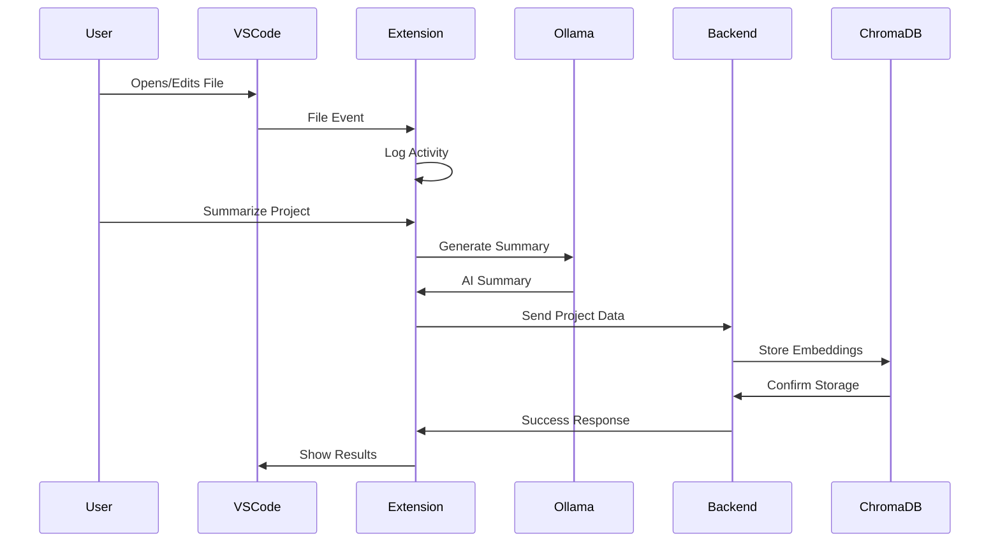

---

## Browser Extension Architecture

### Extension Components

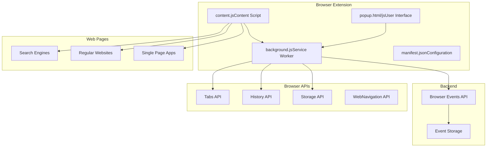

### Tracking Capabilities

**Search Activity Monitoring**
- Detects searches across major search engines (Google, Bing, DuckDuckGo, Yahoo)
- Extracts search queries and tracks search result clicks
- Monitors search result positions and engagement
- Tracks search session duration and patterns

**Website Activity Tracking**
- Monitors website visits and session durations
- Tracks tab switching and focus events
- Captures page titles and domain information
- Detects single-page application navigation

**Engagement Analytics**
- Scroll depth tracking for content engagement
- Page visibility change detection
- Click pattern analysis
- Session time measurement

### Search Engine Integration

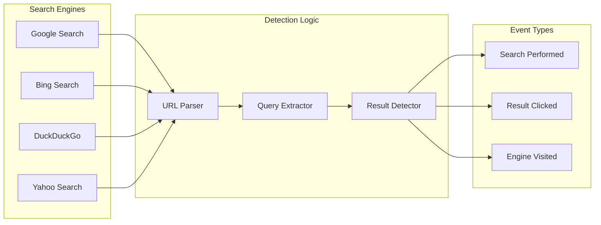

---

## System Monitor Microservice

### Architecture Overview

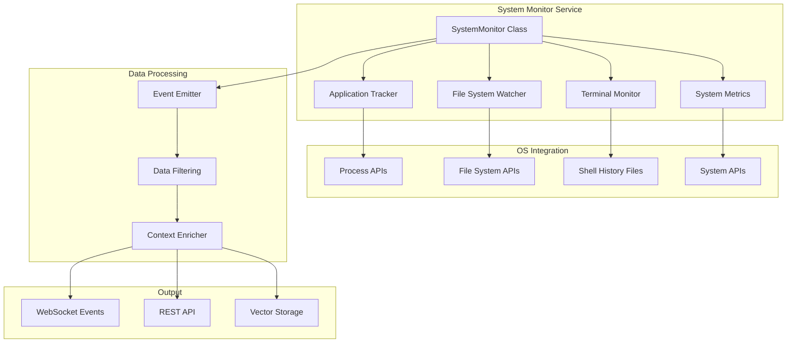

### Cross-Platform Monitoring

**Application Tracking**
```typescript
// Platform-specific application monitoring
switch (this.platform) {
  case 'darwin':
    // macOS: ps -eo comm
    const { stdout } = await execAsync('ps -eo comm | grep -v "^COMMAND"');
    break;
  case 'win32':
    // Windows: tasklist /fo csv
    const { stdout } = await execAsync('tasklist /fo csv');
    break;
  case 'linux':
    // Linux: ps -eo comm --no-headers
    const { stdout } = await execAsync('ps -eo comm --no-headers');
    break;
}
```

**Terminal Command Monitoring**
- Bash history file monitoring (`~/.bash_history`)
- Zsh history tracking (`~/.zsh_history`)
- PowerShell history on Windows
- Real-time process monitoring for active terminals
- Command context detection (git, npm, python, etc.)

**File System Monitoring**
- Recursive directory watching with exclusion filters
- Development file type filtering (.js, .ts, .py, .java, etc.)
- Project context detection and classification
- Change type detection (create, modify, delete)

### Event Processing Pipeline

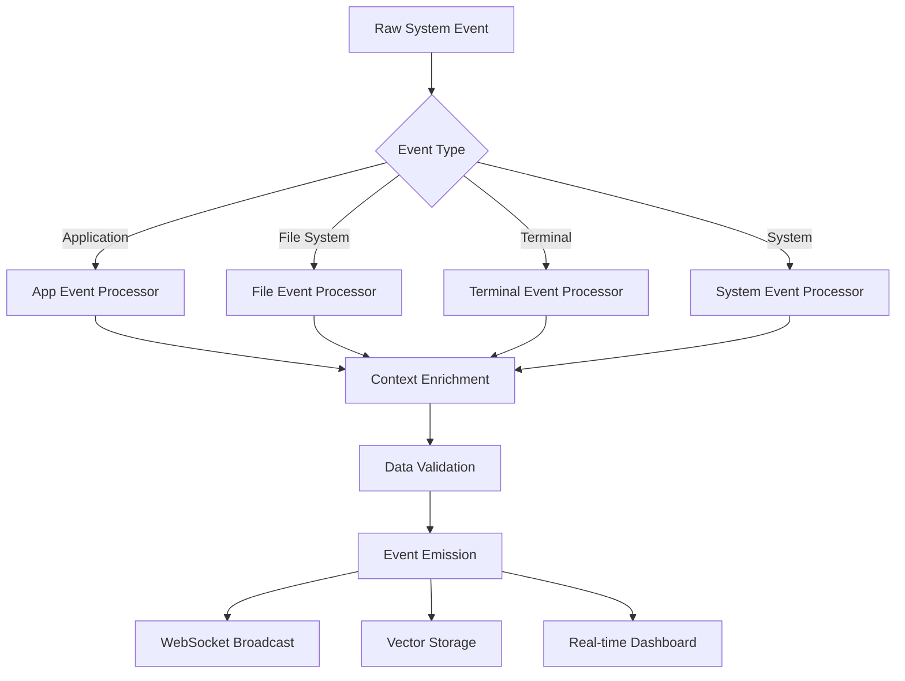

---

## Agentic AI System

### Enhanced Agent Architecture

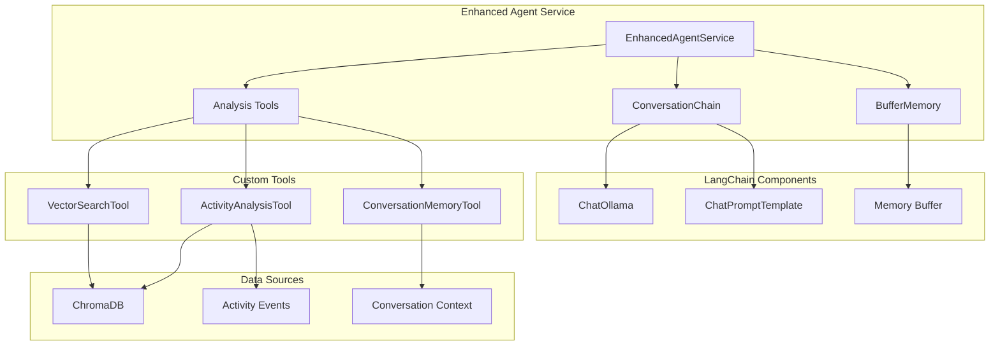

### AI Agent Capabilities

**Conversational Intelligence**
- Persistent conversation memory across sessions
- Context-aware response generation
- Activity data integration in responses
- Natural language query processing

**Activity Analysis Tools**
```typescript
class ActivityAnalysisTool extends Tool {
  name = 'activity_analysis';
  description = 'Analyze and search through user activity data';
  
  async _call(input: string): Promise {
    const events = await this.vectorStore.searchSimilarActivities(input, 50);
    const analysis = this.analyzeEvents(events);
    return JSON.stringify(analysis);
  }
}
```

**Data Processing Pipeline**
- Event categorization and grouping
- Time-based analysis and patterns
- Application usage statistics
- File modification tracking
- Terminal command analysis

### Prompt Engineering

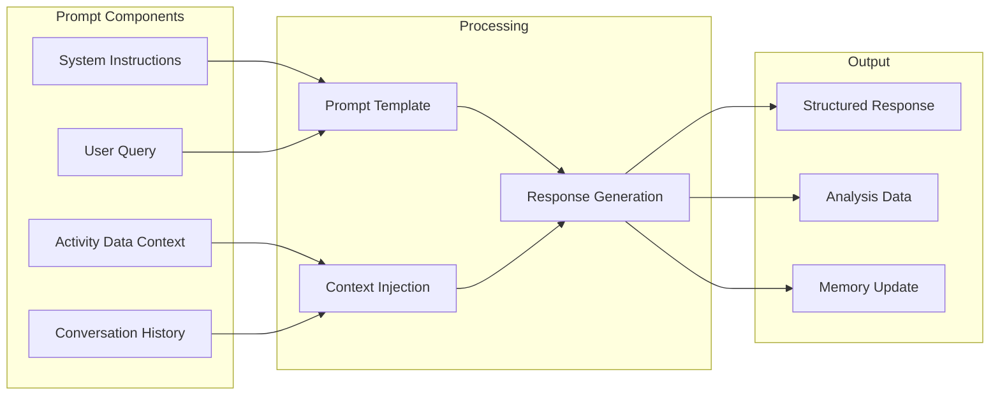

---

## Vector Database Integration

### ChromaDB Architecture

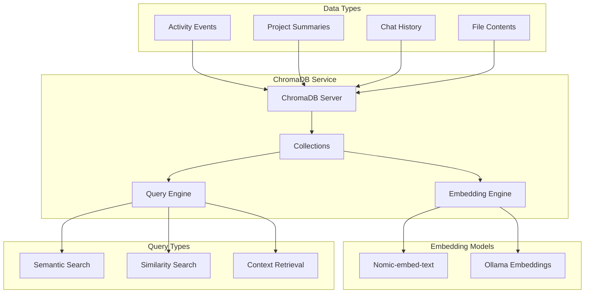

### Vector Storage Implementation

**Event Vectorization**
```typescript
async storeActivityEvent(event: ActivityEvent): Promise {
  const document = new Document({
    pageContent: this.eventToText(event),
    metadata: {
      id: event.id,
      type: event.type,
      timestamp: event.timestamp,
      category: event.category,
      data: JSON.stringify(event.data),
    },
  });
  
  await this.chroma!.addDocuments([document], { ids: [event.id] });
}
```

**Semantic Search Capabilities**
- Natural language activity queries
- Time-based activity retrieval
- Context-aware similarity matching
- Multi-modal data correlation

---

## Desktop Application Architecture

### Electron Frontend Structure

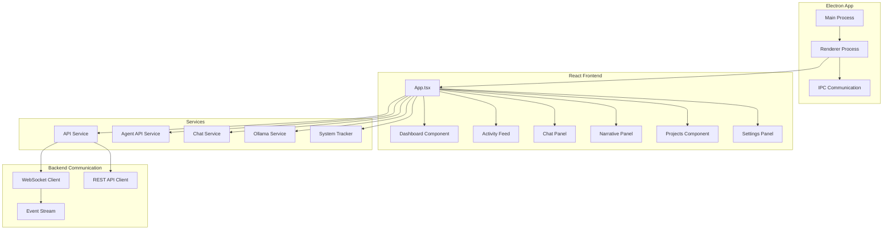

### Component Architecture

**Dashboard Component**
- Real-time activity statistics
- Session tracking and metrics
- Recent activity feed
- Achievement display system

**Chat Panel Integration**
```typescript
const handleSendMessage = async () => {
  const response: ChatResponse = await chatService.sendMessage(inputMessage);
  const assistantMessage: ChatMessage = {
    id: `assistant_${Date.now()}`,
    type: 'assistant',
    content: response.output,
    timestamp: Date.now(),
    analysis: response.analysis
  };
  setMessages(prev => [...prev, assistantMessage]);
};
```

**Narrative Generation System**
- Multiple tone options (casual, professional, gamified, technical)
- Format variations (story, log, achievements, summary)
- Export capabilities (JSON, Markdown, clipboard)
- Achievement system integration

---

## Data Flow Architecture

### Real-time Event Processing

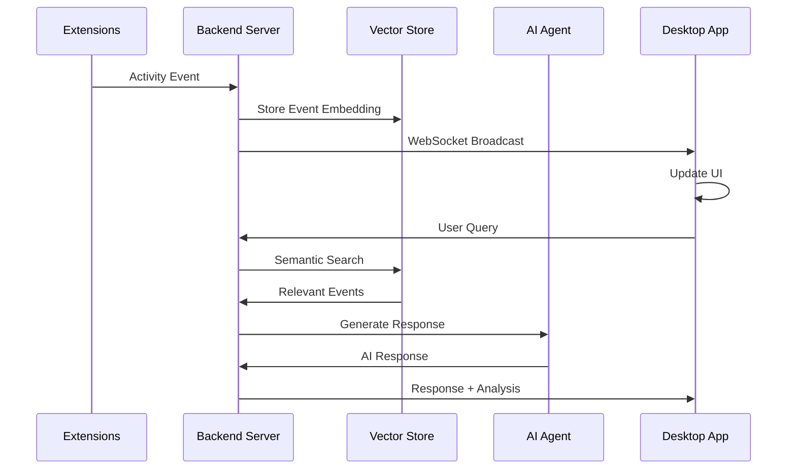

### Project Analysis Workflow

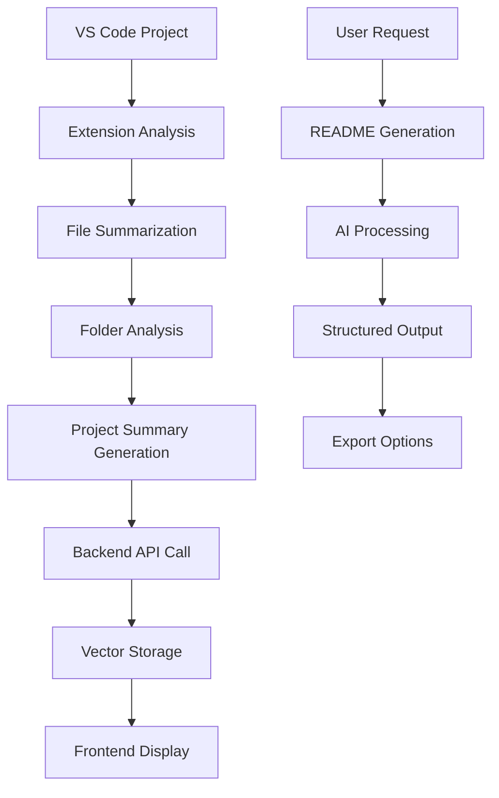

---

## Installation & Setup

### Prerequisites

| Requirement | Version | Purpose |
|-------------|---------|---------|
| Node.js | ≥18.0.0 | Runtime environment |
| npm | ≥8.0.0 | Package management |
| Python | ≥3.8 | Backend AI services |
| Ollama | Latest | Local AI model serving |
| ChromaDB | ≥0.5.15 | Vector database |

### Step-by-Step Installation

**1. Install Ollama and Models**
```bash
# Install Ollama (macOS/Linux)
curl -fsSL https://ollama.ai/install.sh | sh

# Windows: Download from https://ollama.ai/download

# Install required models
ollama pull llama3
ollama pull nomic-embed-text
```

**2. Clone and Setup Main Application**
```bash
# Clone the repository
git clone https://github.com/officiallyutso/chronicle.git
cd chronicle

# Install dependencies
npm install

# Build TypeScript for Electron
npm run build:electron
```

**3. Setup Backend Services**
```bash
# Navigate to backend directory
cd backend

# Install backend dependencies
npm install

# Start the backend server
npm run dev
```

**4. Setup ChromaDB Vector Database**
```bash
# Install ChromaDB
pip install chromadb

# Start ChromaDB server
chroma run --host 0.0.0.0 --port 8000 --path ../chronicle_data
```

**5. Install VS Code Extension**
```bash
# Navigate to VS Code extension directory
cd vs-code-extension

# Install dependencies
npm install

# Compile the extension
npm run compile

# Install in VS Code
# Method 1: Press F5 to run in development mode
# Method 2: Package and install
vsce package
code --install-extension chronicle-*.vsix
```

**6. Install Browser Extension**

**Chrome/Edge:**
1. Open `chrome://extensions/`
2. Enable "Developer mode"
3. Click "Load unpacked"
4. Select the `chronicle-browser-extension` folder

**Firefox:**
1. Open `about:debugging`
2. Click "This Firefox"
3. Click "Load Temporary Add-on"
4. Select `manifest.json` from the extension folder

**7. Start the Complete System**
```bash
# Terminal 1: Start ChromaDB
chroma run --host 0.0.0.0 --port 8000 --path ./chronicle_data

# Terminal 2: Start Backend
cd backend && npm run dev

# Terminal 3: Start Desktop App
npm run dev:all
```

---

## Advanced Configuration

### Environment Variables
```bash
# Backend Configuration (.env)
PORT=3001
OLLAMA_BASE_URL=http://localhost:11434
CHROMA_URL=http://localhost:8000
EMBEDDING_MODEL=nomic-embed-text
CHAT_MODEL=llama3
```

### VS Code Extension Settings
```json
{
  "chronicle.autoSummarize": true,
  "chronicle.trackFileChanges": true,
  "chronicle.backendUrl": "http://localhost:3001",
  "chronicle.maxFileSummaryLines": 80
}
```

### Browser Extension Configuration
```javascript
// Extension settings
const BACKEND_URL = 'http://localhost:3001';
const SEARCH_ENGINES = {
  'google.com': 'Google',
  'bing.com': 'Bing',
  'duckduckgo.com': 'DuckDuckGo'
};
```

---

## API Reference

### Core Backend Endpoints

| Endpoint | Method | Purpose | Request Body |
|----------|--------|---------|--------------|
| `/api/events` | GET | Retrieve activity events | Query params: type, limit, startTime, endTime |
| `/api/stats` | GET | Get session statistics | None |
| `/api/ai/chat` | POST | Chat with AI agent | `{ message: string }` |
| `/api/ai/narrative` | POST | Generate activity narrative | `{ style: NarrativeStyle }` |
| `/api/projects` | GET/POST | Project management | Project data object |
| `/api/projects/:id/readme` | POST | Generate README | None |
| `/api/tracking/start` | POST | Start activity tracking | None |
| `/api/tracking/stop` | POST | Stop activity tracking | None |

### WebSocket Events

```typescript
interface WebSocketMessage {
  type: 'INITIAL_EVENTS' | 'NEW_EVENT';
  data: ActivityEvent | ActivityEvent[];
}

interface ActivityEvent {
  id: string;
  timestamp: number;
  type: ActivityType;
  data: any;
  category: string;
}
```

### Extension APIs

**VS Code Extension Commands**
```typescript
// Available commands
'chronicle.activateChronicle'      // Start tracking
'chronicle.deactivateChronicle'    // Stop tracking
'chronicle.summarizeProject'       // Analyze entire project
'chronicle.summarizeCurrentFile'   // Analyze current file
'chronicle.summarizeCurrentFolder' // Analyze current folder
'chronicle.openLog'               // View activity log
```

**Browser Extension Messages**
```javascript
// Message types
chrome.runtime.sendMessage({
  type: 'SEARCH_RESULT_CLICK',
  url: string,
  title: string,
  searchEngine: string,
  searchQuery: string,
  position: number
});
```

---

## Performance Optimization

### System Requirements
- **RAM**: Minimum 8GB (16GB recommended for large projects)
- **Storage**: 2GB free space for models and data
- **CPU**: Modern multi-core processor for AI inference
- **Network**: Local network for service communication

### Optimization Strategies

**Vector Database Optimization**
```typescript
// Batch processing for better performance
const batchSize = 100;
const eventBatches = chunk(events, batchSize);
for (const batch of eventBatches) {
  await vectorStore.addDocuments(batch);
}
```

**Memory Management**
- Conversation history limited to last 6 messages
- Event cleanup after 10 minutes of inactivity
- Automatic garbage collection for old embeddings

**AI Model Optimization**
- Use quantized models for better performance
- Implement response caching for common queries
- Batch similar requests for efficiency

---

## Security & Privacy

### Data Protection
- **100% Local Processing**: All data remains on your machine
- **No Cloud Dependencies**: Complete offline functionality
- **Encrypted Storage**: Vector embeddings provide data abstraction
- **User Control**: Full data export and deletion capabilities

### Security Features
- **Sandboxed Extensions**: Browser and VS Code extensions run in isolated environments
- **API Validation**: Input sanitization and validation
- **Local Inference**: AI processing entirely on local machine
- **No Telemetry**: Zero data transmission to external servers

---

## Troubleshooting

### Common Issues and Solutions

**Ollama Connection Issues**
```bash
# Check Ollama status
ollama list

# Restart Ollama service
ollama serve

# Pull required models
ollama pull llama3
ollama pull nomic-embed-text
```

**ChromaDB Connection Problems**
```bash
# Verify ChromaDB is running
curl http://localhost:8000/api/v1/heartbeat

# Restart ChromaDB with correct path
chroma run --host 0.0.0.0 --port 8000 --path ./chronicle_data

# Check ChromaDB logs
chroma run --host 0.0.0.0 --port 8000 --path ./chronicle_data --log-level DEBUG
```

**Extension Issues**
1. **VS Code Extension Not Working**
   - Check extension activation in VS Code output panel
   - Verify backend server is running on port 3001
   - Ensure Ollama is accessible at localhost:11434

2. **Browser Extension Not Tracking**
   - Check extension permissions in browser settings
   - Verify background script is active
   - Check browser console for errors

**Backend Service Issues**
```bash
# Check all services status
curl http://localhost:3001/api/health
curl http://localhost:11434/api/tags
curl http://localhost:8000/api/v1/heartbeat

# Restart services in order
# 1. ChromaDB
# 2. Ollama
# 3. Backend server
# 4. Desktop app
```

---

## Development & Contributing

### Development Setup
```bash
# Frontend development
npm run dev

# Backend development
cd backend && npm run dev

# Extension development
cd vs-code-extension && npm run compile

# Full stack development
npm run dev:all
```

### Project Structure
```
chronicle/
├── backend/                    # Express.js backend
│   ├── src/
│   │   ├── services/          # Core services
│   │   │   ├── agentService.ts
│   │   │   ├── systemMonitor.ts
│   │   │   └── vectorStore.ts
│   │   └── server.ts          # Main server file
│   └── package.json
├── src/                       # React frontend
│   ├── components/            # UI components
│   ├── services/             # Frontend services
│   └── App.tsx               # Main application
├── chronicle-browser-extension/
│   ├── background.js         # Service worker
│   ├── content.js            # Content script
│   └── manifest.json         # Extension manifest
├── vs-code-extension/
│   ├── src/
│   │   ├── extension.ts      # Main extension file
│   │   └── summarizer.ts     # AI summarization
│   └── package.json
└── electron/
    └── main.ts               # Electron main process
```

---

## Future Roadmap

### Upcoming Features
- **Mobile Companion App**: iOS/Android activity sync
- **Team Analytics**: Collaborative productivity insights
- **Advanced Visualizations**: Interactive activity charts and graphs
- **Plugin System**: Extensible architecture for custom integrations
- **Cloud Sync Option**: Optional encrypted cloud backup
- **Multi-Language Support**: Support for additional programming languages

### Performance Improvements
- **Streaming Responses**: Real-time AI response streaming
- **Incremental Indexing**: Efficient vector database updates
- **Background Processing**: Non-blocking activity analysis
- **Caching Layer**: Intelligent response caching system

---

## License

This project is licensed under the MIT License. See the [LICENSE](LICENSE) file for details.

---

## Acknowledgments

- **LangChain**: For the powerful AI framework and tool ecosystem
- **Ollama**: For enabling local AI model serving and inference
- **ChromaDB**: For providing excellent vector database capabilities
- **React Team**: For the excellent frontend framework and ecosystem
- **Electron**: For enabling cross-platform desktop development
- **VS Code Team**: For the comprehensive extension API
- **Chrome Extensions**: For the robust browser extension platform

**Chronicle** - Transform your digital activities into intelligent insights, completely locally and securely. Experience the future of productivity tracking with AI-powered analysis and narrative generation.


